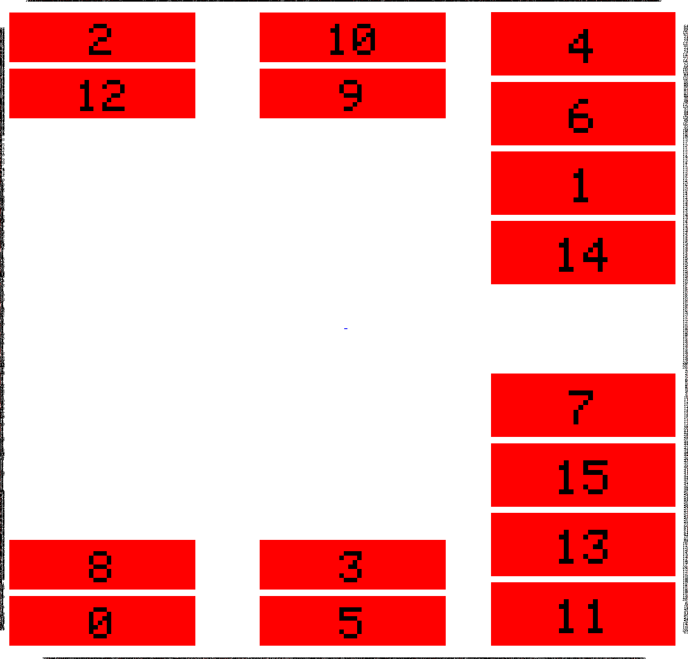
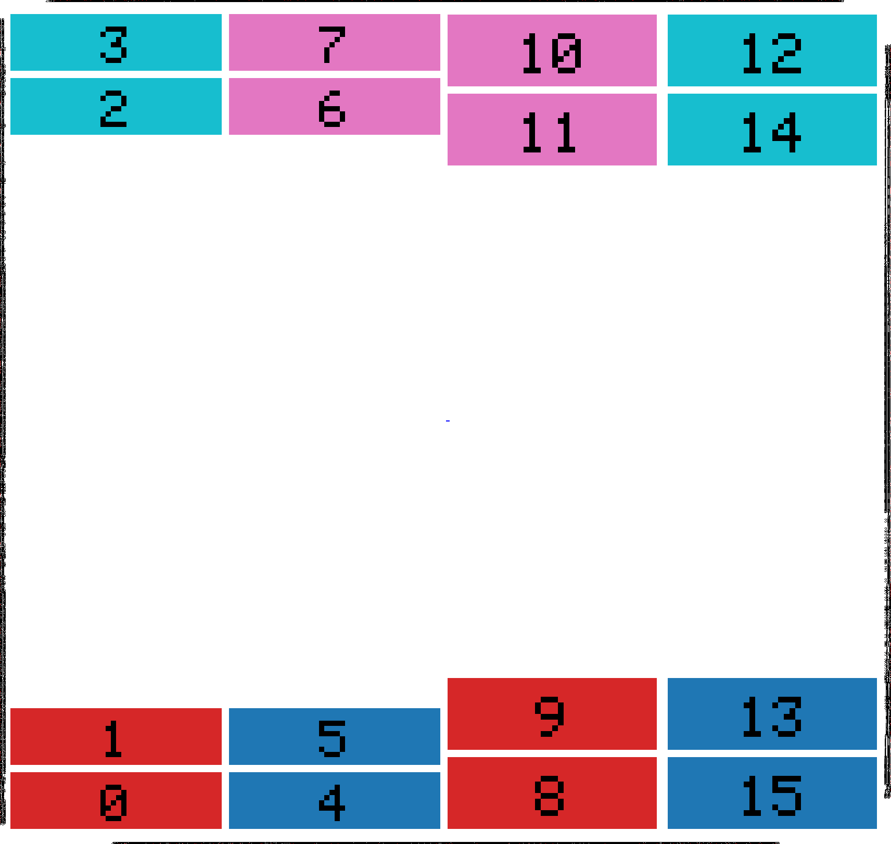
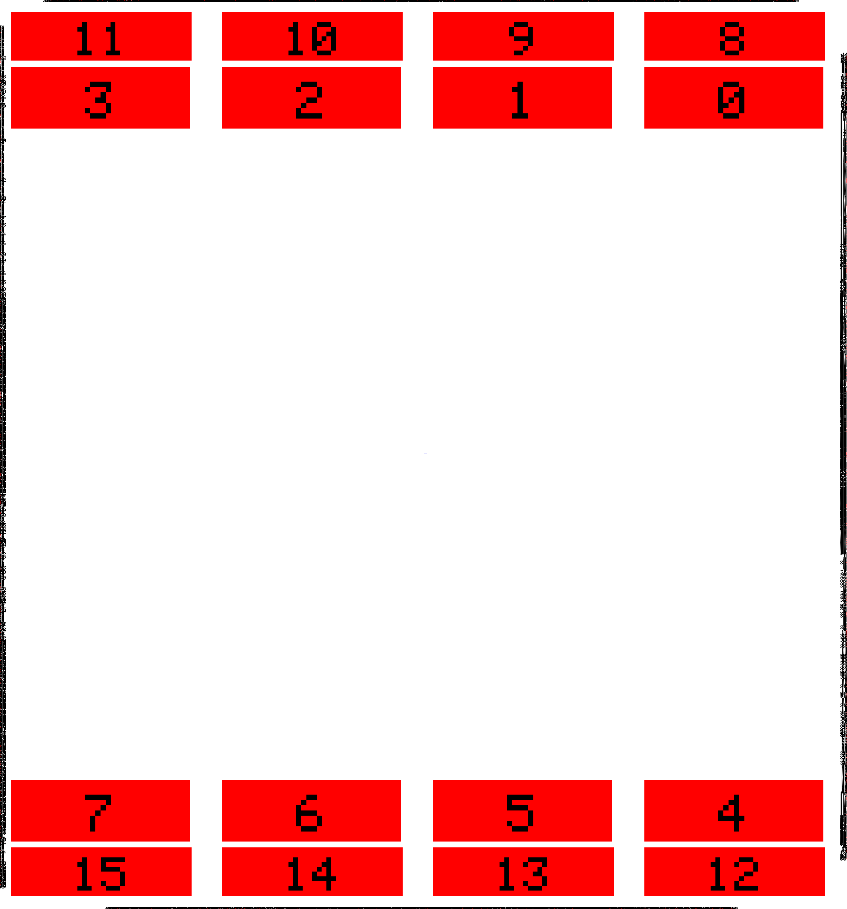

# ERPlacer
ERPlacer is a **Rust-based placement tool** inspired by [DREAMPLACE](https://github.com/limbo018/DREAMPlace), with a focus on simplicity, readability, and hobbyist-friendly design. It is intended as a **research and industry-ready starting point** for moving high-performance EDA algorithms to Rust.
> ⚡ Currently, ERPlacer runs **as fast as DREAMPlace on CPU**. GPU acceleration is **not supported yet**.

## Results

| ispd19_test7 | ispd19_test8 | ispd19_test9 |
|:---:|:---:|:---:|
|  |  |  |

## Features
- Port of DREAMPLACE concepts to Rust
- Clean, readable code for hobbyists, researchers, and industry developers
- LEF/DEF parsing via:
  - [reda-lefdef](https://github.com/giammirove/reda-lefdef)
- KISS philosophy: Keep It Simple, Stupid
- Multi-threaded placement via Rayon
- CPU performance comparable to DREAMPlace (no GPU support yet)

## Philosophy
The goal of ERPlacer is **clarity and simplicity**. While performance is important, the primary focus is **readable, maintainable, and educational code**. This makes it easier for hobbyists and researchers to understand, modify, and experiment with placement algorithms, while still providing a strong foundation for industrial adoption.

## Limitations
- Only performs **Global Placement** (no detailed/final placement)
- No support for **filler cells** or regions
- No timing-aware placement
- No routing support
- GPU acceleration is not available
- Tested only on ISPD19 benchmarks

## Installation
```bash
git clone https://github.com/giammirove/reda-erplacer.git
cd reda-erplacer
cargo build --release
```

## Downloading Test Cases

ISPD19 benchmarks (tests 1–10) can be downloaded in parallel with the provided script:

```bash
./designs/download_designs.sh
```

This fetches all benchmarks from the [ISPD 2019 contest](https://www.ispd.cc/contests/19/) and extracts them into `designs/`, ready to be used with `run.sh`.

## Usage

The easiest way to run ERPlacer is via the provided `designs/run.sh` script, which automatically locates the LEF/DEF files in a design directory and forwards any extra arguments to the binary:

```bash
./designs/run.sh designs/ispd19_test8 --iterations 600
```

Any additional flags are passed straight through to the placer:

```bash
./designs/run.sh designs/ispd19_test8 \
    --iterations 600 \
    --macro-colors macro_colors.csv \
    --save-macros saved_macros.csv \
    --full-diearea
```

The script uses all available CPU threads by default. Override with `RAYON_NUM_THREADS`:

```bash
RAYON_NUM_THREADS=22 ./designs/run.sh designs/ispd19_test8 --iterations 450
```

Placement images are written to `./images/` during the run.

### Running manually

If you prefer to invoke the binary directly:

```bash
mkdir -p images
export RAYON_NUM_THREADS=22
export TEST=8
./target/release/reda-erplacer \
    --lef "designs/ispd19_test${TEST}/ispd19_test${TEST}.input.lef" \
    --def "designs/ispd19_test${TEST}/ispd19_test${TEST}.input.def" \
    --iterations 600
```

## Test
```bash
cargo test --release -- --nocapture
```

## Contributing
Contributions are welcome!
- Keep new code simple and readable.
- Document any changes or new algorithms.
- Benchmarks and tests are encouraged to ensure performance and correctness.

## References
- **[DREAMPLACE](https://github.com/limbo018/DREAMPlace)**: Original GPU-accelerated placer
- **[reda-db](https://github.com/giammirove/reda-db.git)**: Rust database for placement data
- **[reda-lefdef](https://github.com/giammirove/reda-lefdef.git)**: Rust parser for LEF/DEF files
